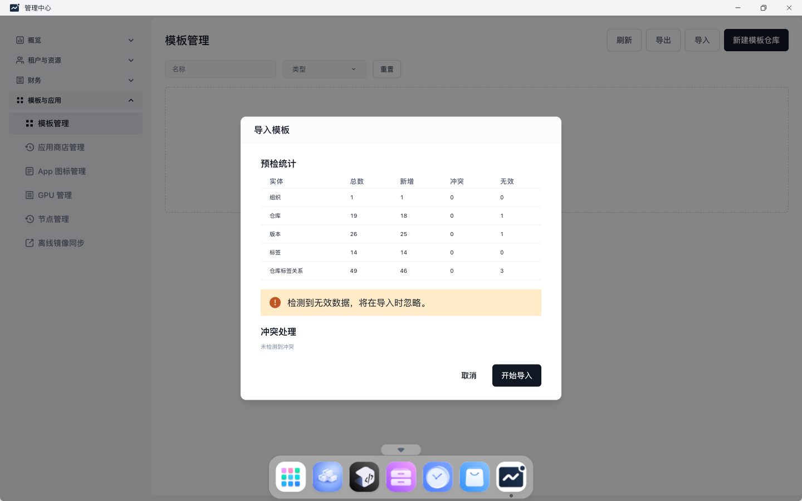
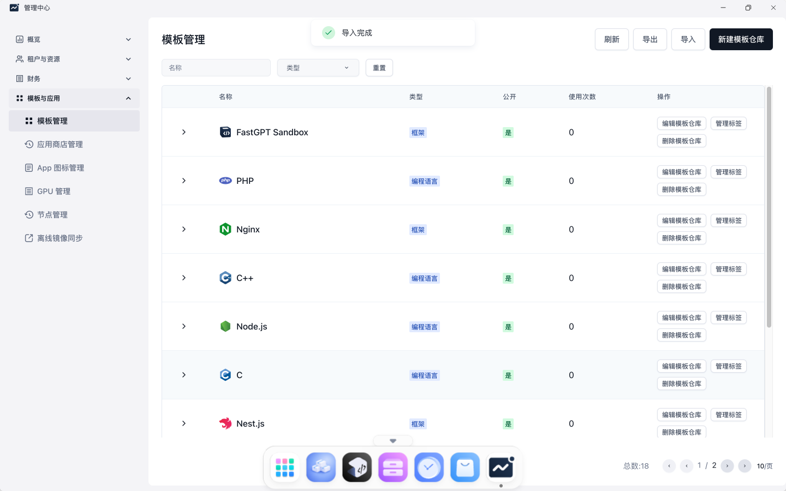

# TC-01 管理中心导入 DevBox 模板 Excel

## 测试目的

验证管理员登录平台后，可以通过页面导入 `/Users/cuisongliu/Downloads/devbox-amd.xlsx`，使 DevBox 页面可以使用 Go 等运行时模板。

## 前置条件

- Sealos Cloud 已安装完成。
- 使用 `admin` 登录平台。
- 本地存在模板文件：`/Users/cuisongliu/Downloads/devbox-amd.xlsx`。

## 测试流程

1. 打开 Sealos Cloud 首页。
2. 使用账号密码登录。
3. 打开“管理中心”。
4. 进入“模板与应用” -> “模板管理”。
5. 点击“导入”。
6. 选择 `devbox-amd.xlsx`。
7. 点击“预检”。
8. 预检通过后点击“开始导入”。

## 预期结果

- 页面展示模板导入预检结果。
- 点击开始导入后，页面展示导入完成。
- DevBox 模板列表中可见 Go 模板。

## 实际结果

PASS。页面预检和导入完成均符合预期，后续 DevBox 创建流程可以选择 `Go 1.22.5` 模板。

## 截图

