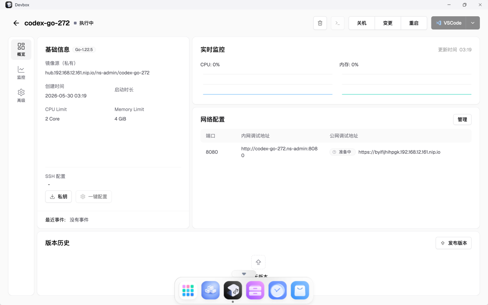

# TC-02 页面创建 Go DevBox

## 测试目的

验证通过 DevBox 页面创建 Go 运行时 DevBox，创建后 Kubernetes 资源正常生成。

## 前置条件

- TC-01 已通过。
- DevBox 模板已导入。

## 测试数据

- DevBox 名称：`codex-go-272`
- 模板：`Go 1.22.5`
- CPU：`2 Core`
- 内存：`4 GiB`
- 端口：`8080`

## 测试流程

1. 打开 DevBox 应用。
2. 点击“新建 DevBox”。
3. 选择 Go 模板。
4. 填写名称、资源规格和端口。
5. 点击创建。
6. 返回列表查看 DevBox 状态。
7. 通过远端 Kubernetes 资源确认 DevBox、Pod、Service、Ingress 已创建。

## 预期结果

- 页面列表出现 `codex-go-272`。
- DevBox 状态为运行中。
- 镜像源为本地 registry 域名。
- 远端资源 Ready。

## 实际结果

PASS。页面展示 `codex-go-272`，远端资源检查通过。

## 截图

## 结果文件

- `../results/devbox-created-resource-check.txt`

