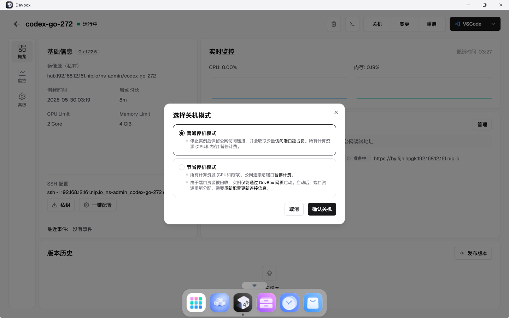
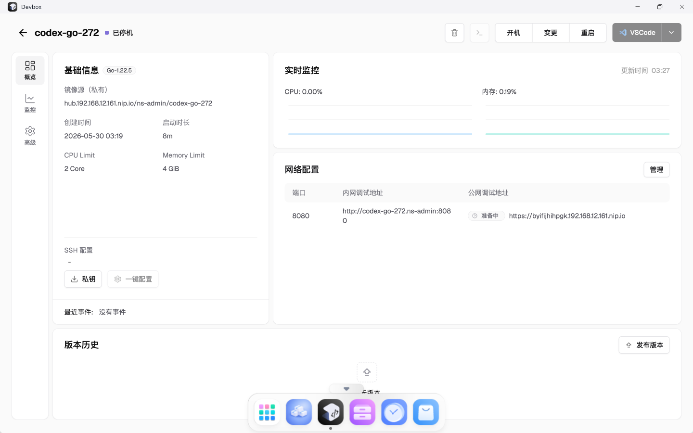
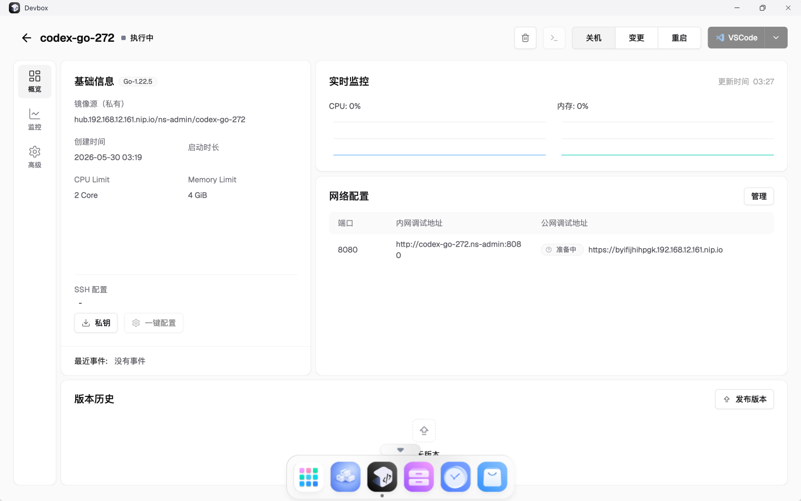

# TC-03 普通停机后再启动

## 测试目的

验证 DevBox 页面普通停机和再次启动流程可用，并且状态能恢复。

## 前置条件

- TC-02 已通过。
- `codex-go-272` 已创建。

## 测试流程

1. 进入 `codex-go-272` 详情页。
2. 点击“关机”。
3. 在弹窗中选择普通停机。
4. 提交停机。
5. 页面确认停机后点击“开机”。
6. 等待 DevBox 回到可运行状态。

## 预期结果

- 停机弹窗正常出现。
- 普通停机提交后 DevBox 状态变化。
- 再次开机后 DevBox 恢复运行。

## 实际结果

PASS。普通停机和再次开机流程均通过页面完成。

## 截图

## 结果文件

- `../results/final-health-after-v3-and-ui.txt`

