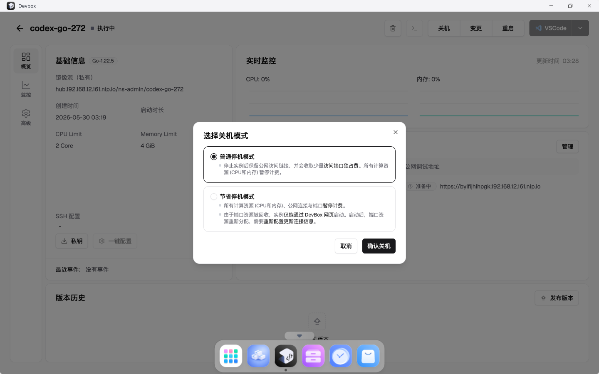
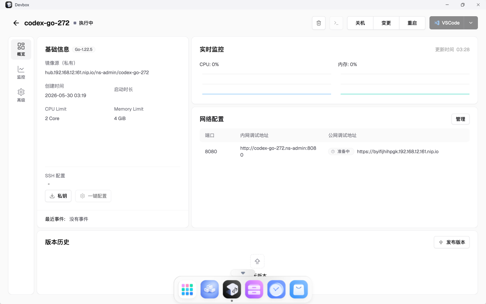
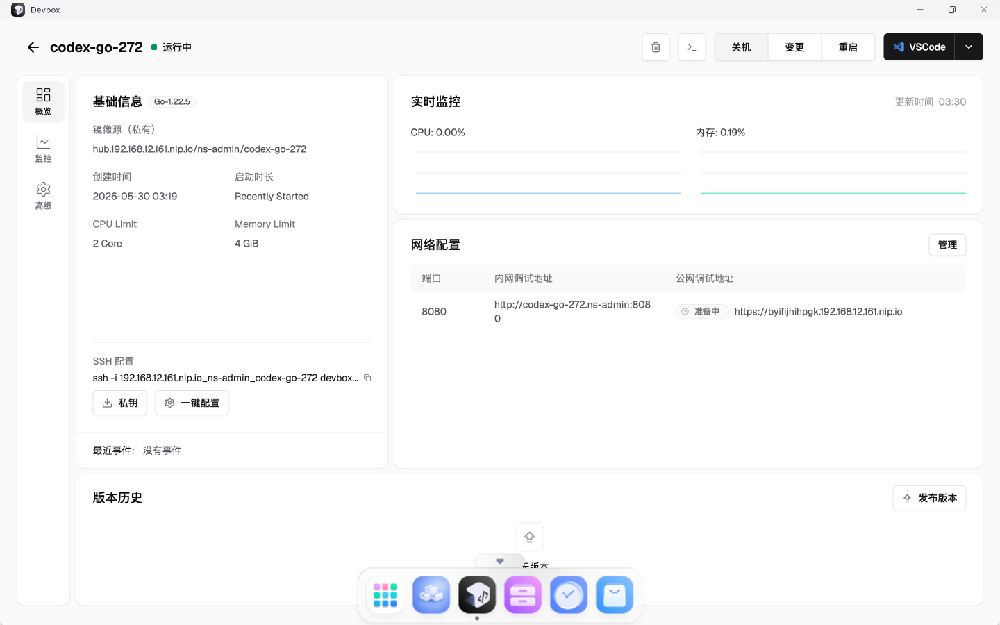

# TC-04 冷停机后再启动

## 测试目的

验证 DevBox 页面冷停机和再次启动流程可用，冷停机后 Pod 被释放，再启动后恢复运行。

## 前置条件

- `codex-go-272` 已创建。
- DevBox 页面可访问。

## 测试流程

1. 进入 `codex-go-272` 详情页。
2. 点击“关机”。
3. 在停机弹窗中选择节省停机。
4. 提交冷停机。
5. 确认 DevBox 进入停机状态。
6. 点击“开机”。
7. 等待 DevBox 重新运行。

## 预期结果

- 冷停机后 DevBox 状态为停机。
- 冷停机释放运行 Pod。
- 再次开机后页面显示运行状态。

## 实际结果

PASS。冷停机和再次启动均通过页面完成，最终健康检查无非 Running Pod。

## 截图

## 结果文件

- `../results/final-health-after-v3-and-ui.txt`

