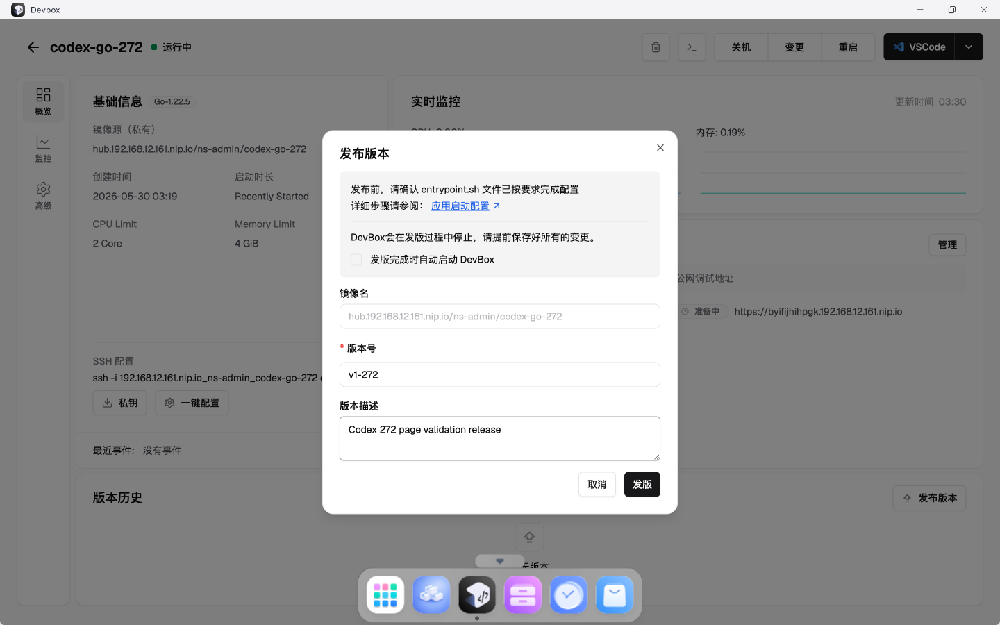
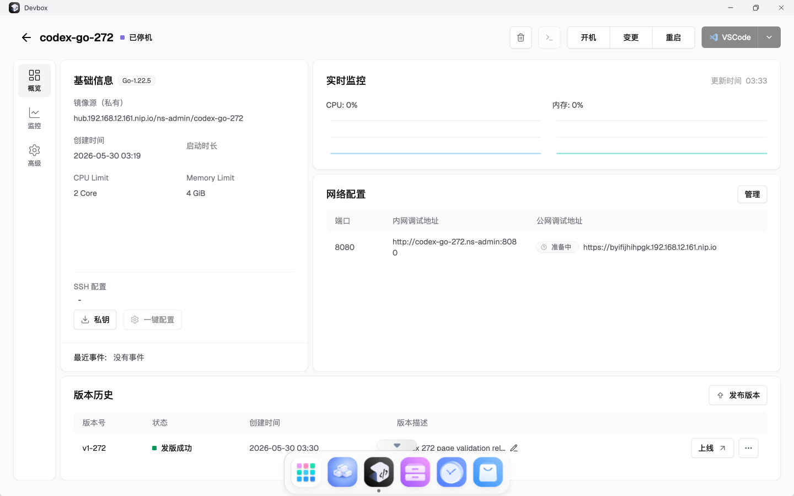

# TC-05 发布 DevBox 版本

## 测试目的

验证通过页面发布 DevBox 版本，并确认 DevBoxRelease 状态为成功，发布镜像写入本地 registry。

## 前置条件

- `codex-go-272` 已创建并可运行。

## 测试数据

- 版本号：`v1-272`
- 描述：`Codex 272 page validation release`

## 测试流程

1. 进入 `codex-go-272` 详情页。
2. 点击“发布版本”。
3. 填写版本号和版本描述。
4. 提交发布。
5. 等待版本历史中状态变为“发版成功”。
6. 远端检查 `DevBoxRelease` 状态和镜像。

## 预期结果

- 页面版本历史出现 `v1-272`。
- 状态为“发版成功”。
- 远端 `DevBoxRelease` phase 为 `Success`。
- 原始镜像在 `hub.192.168.12.161.nip.io` 下。

## 实际结果

PASS。`codex-go-272-v1-272` 状态为 `Success`，原始镜像为 `hub.192.168.12.161.nip.io/ns-admin/codex-go-272:z2h9j-2026-05-29-193030`。

## 截图

## 结果文件

- `../results/devbox-release-v1-272-watch.txt`

