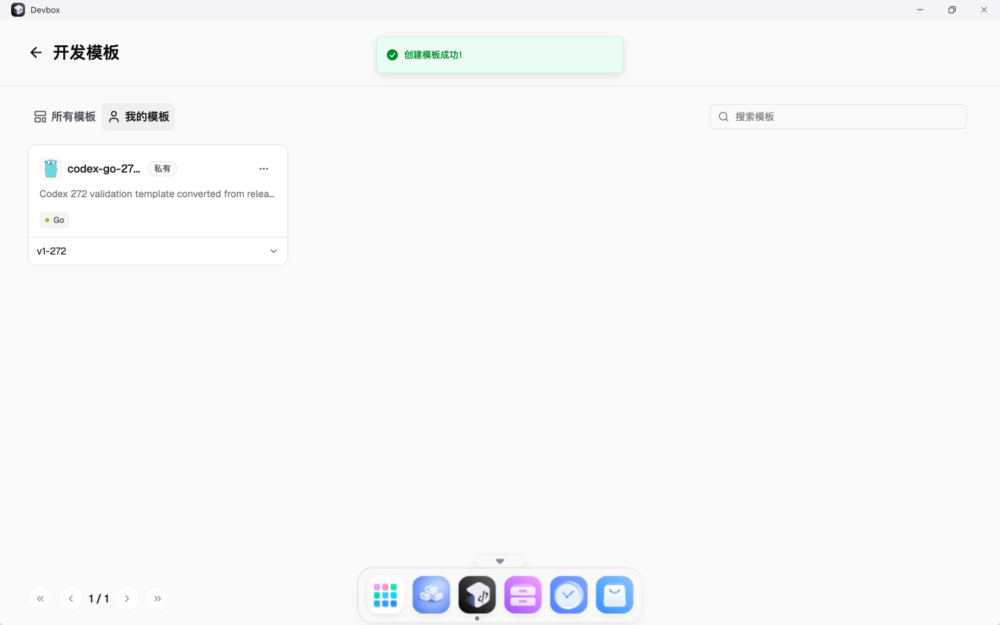
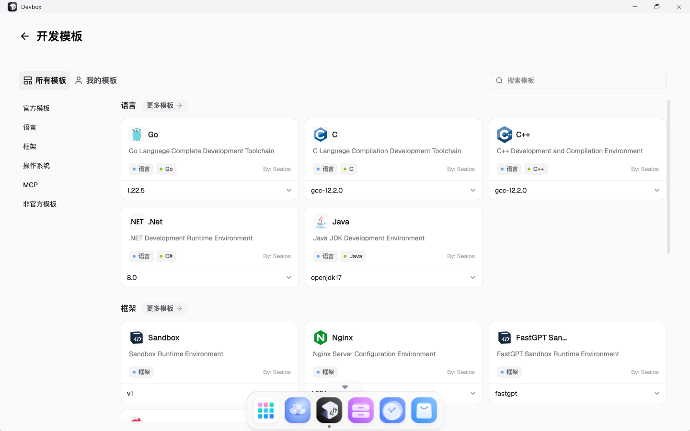
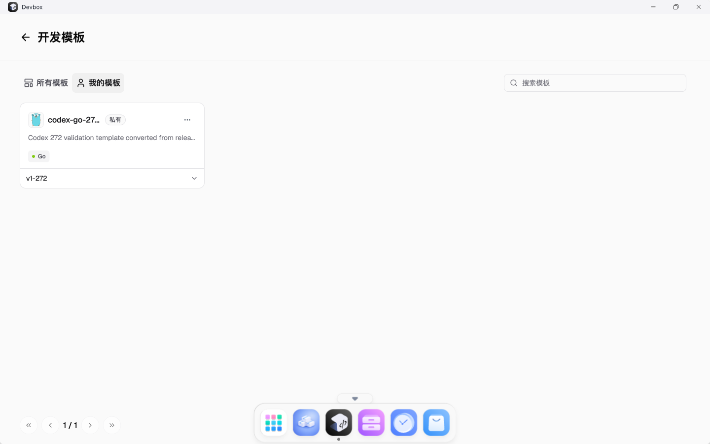

# TC-06 发布版本转换为模板

## 测试目的

验证发布版本可以通过页面转换为私有模板，并且转换后的模板可以在“我的模板”中看到。

## 前置条件

- TC-05 已通过。
- `v1-272` 版本发布成功。
- 前端 `NODE_TLS_REJECT_UNAUTHORIZED` 在自签证书环境中为 `0`。

## 测试数据

- 模板名称：`codex-go-272-template`
- 模板版本：`v1-272`
- 标签：`Go`
- 可见性：私有

## 测试流程

1. 进入 DevBox 详情页。
2. 在版本历史中打开 `v1-272` 的更多菜单。
3. 点击“转换成模板”。
4. 填写模板名称、版本、描述和标签。
5. 提交创建。
6. 进入“浏览模板” -> “我的模板”确认模板存在。

## 预期结果

- 页面提示“创建模板成功”。
- “我的模板”中出现 `codex-go-272-template`。
- 模板版本为 `v1-272`，标签为 `Go`。

## 实际结果

PASS。转换模板成功，“我的模板”页面可见 `codex-go-272-template`。

## 截图

## 结果文件

- `../results/final-health-after-v3-and-ui.txt`

