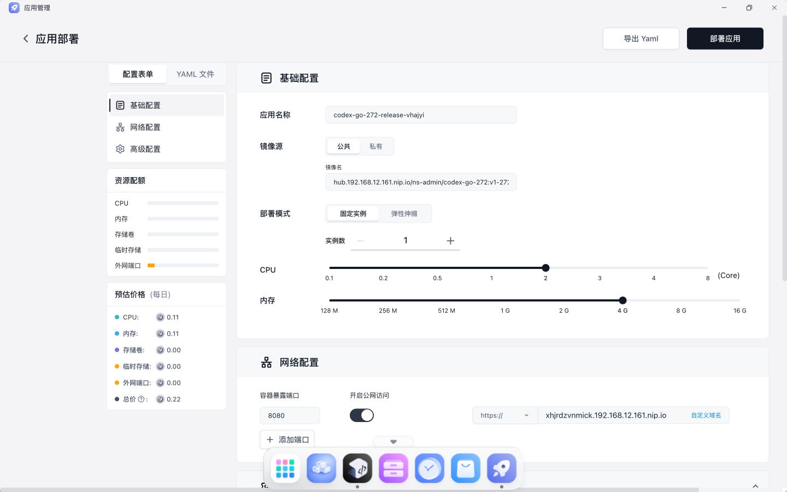
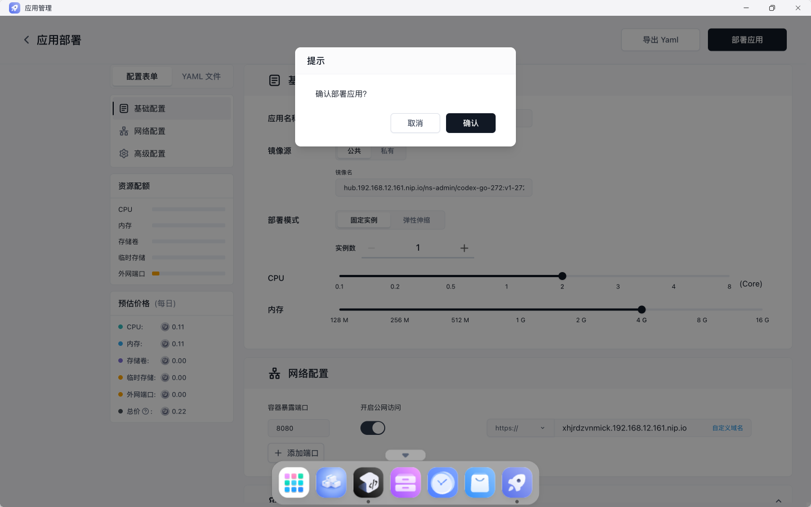
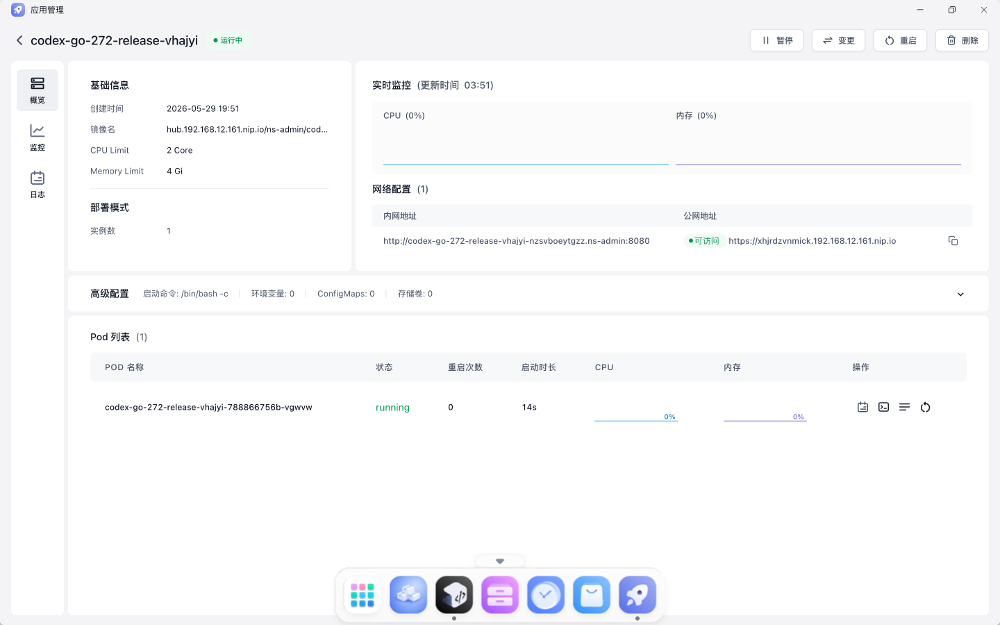

# TC-07 发布版本上线到应用管理

## 测试目的

验证 DevBox 发布版本可以通过页面上线到应用管理，并在 AppLaunchpad 中创建运行中的应用。

## 前置条件

- TC-05 已通过。
- `v1-272` 版本发布成功。

## 测试数据

- 发布版本：`v1-272`
- 应用名：`codex-go-272-release-vhajyi`
- 镜像：`hub.192.168.12.161.nip.io/ns-admin/codex-go-272:v1-272`

## 测试流程

1. 进入 `codex-go-272` 详情页。
2. 在版本历史中点击 `v1-272` 的“上线”。
3. 页面跳转到 AppLaunchpad 预填部署表单。
4. 点击“部署应用”。
5. 在确认弹窗中点击“确认”。
6. 等待进入应用详情页。
7. 远端检查 Deployment、Service、Pod。

## 预期结果

- AppLaunchpad 表单自动填入镜像和资源配置。
- 确认部署后进入应用详情页。
- 应用状态为运行中。
- Pod 为 `1/1 Running`。

## 实际结果

PASS。应用 `codex-go-272-release-vhajyi` 创建成功并运行中，Pod `1/1 Running`。

## 截图

## 结果文件

- `../results/app-management-publish-check.txt`

